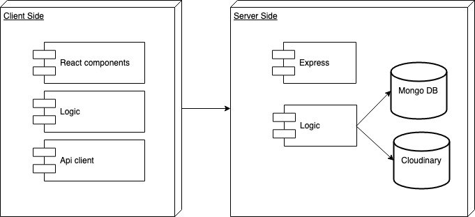
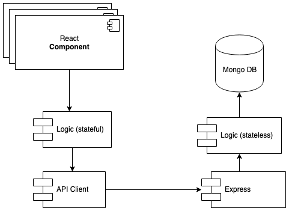
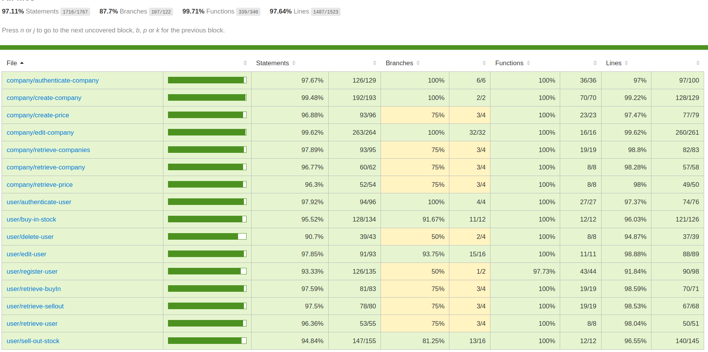

# Avarus

Avarus is a mobile game that has a fictional stock market. When the user makes the account registration for the first time, this user will obtain a predetermined initial budget of the fictitious currency which he can use it to invest and earn profits by doing the operations of buying and selling of such assets.

## Features

Users is able to:
- login and register
- search stocks and check a particular stock's detailç
- buy or sell stocks
- check transactions history and check budget variation
- update personal profile and add favorite
- logout

## Functional Description
### Use cases
)

## Technical Description
### Blocks

### Components

### Data Model

### Code Coverage

### ToDo

- Favorite
- Personal Profile
- Update picture
- Improvement of price algorithm
- Comment 
- Connections
- form Equip
- Tests